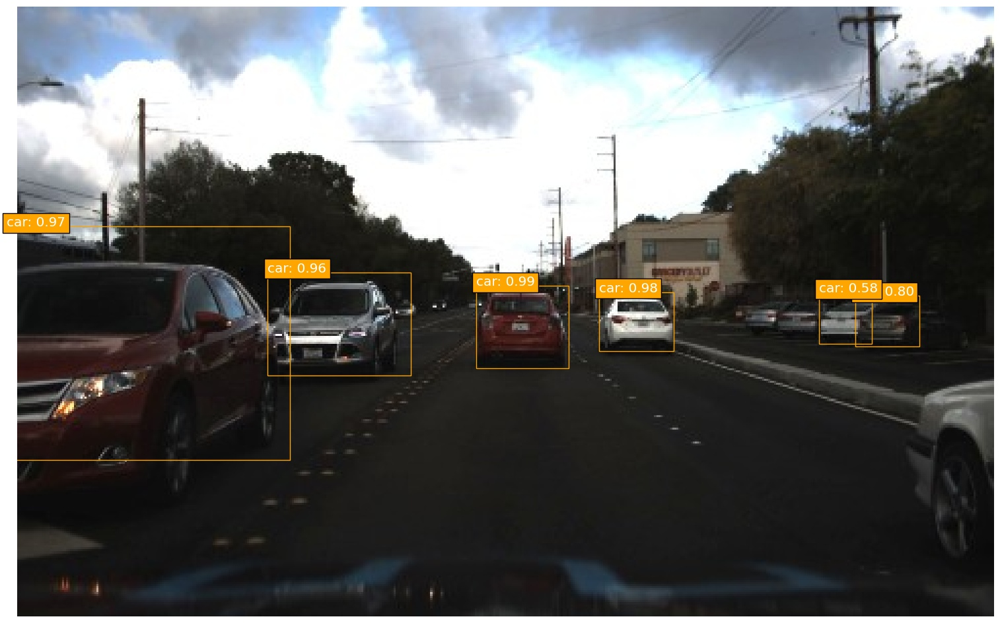
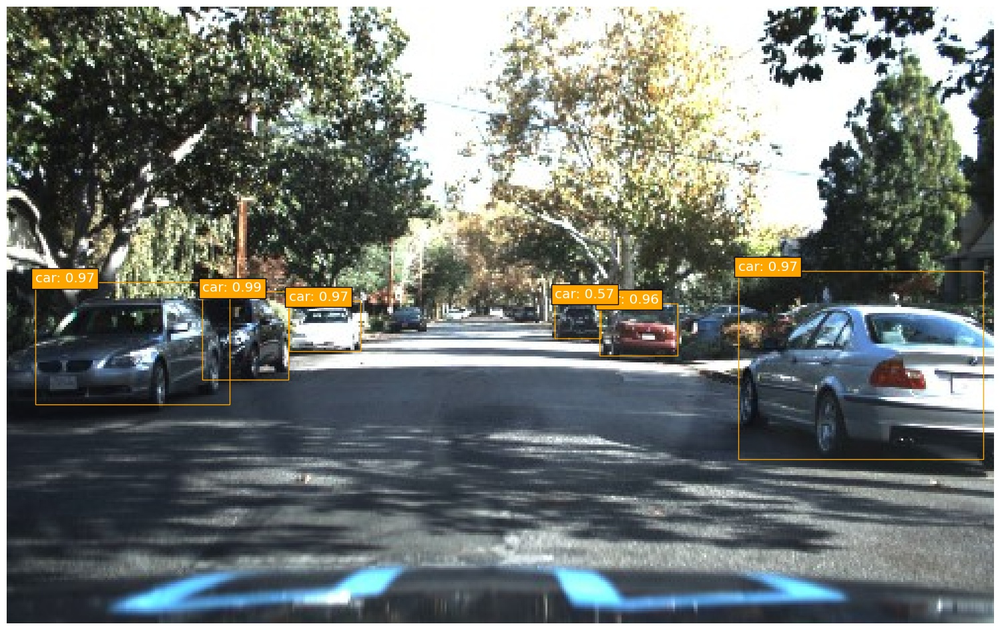
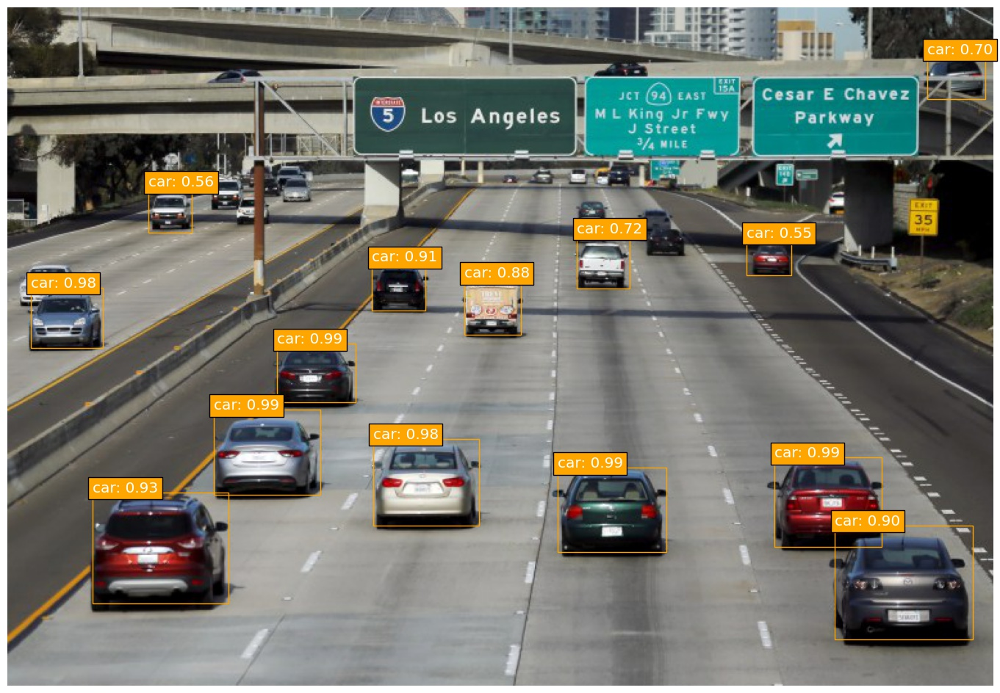
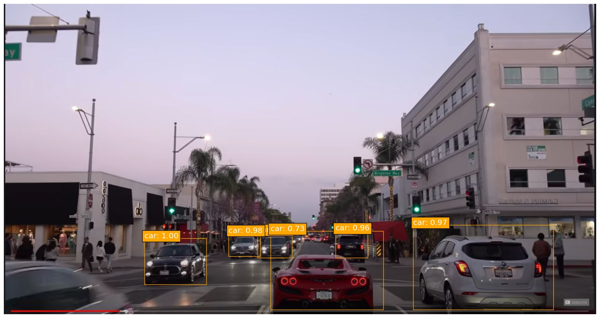
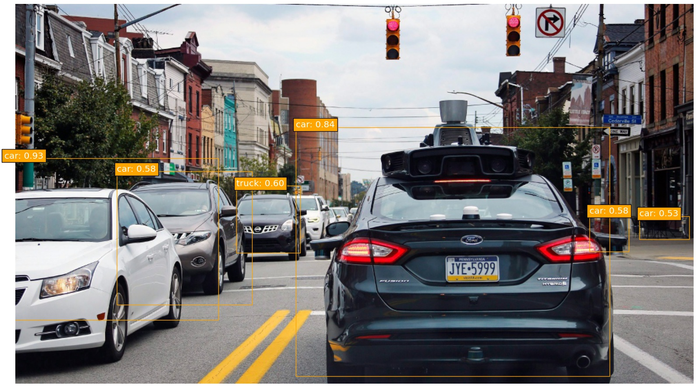
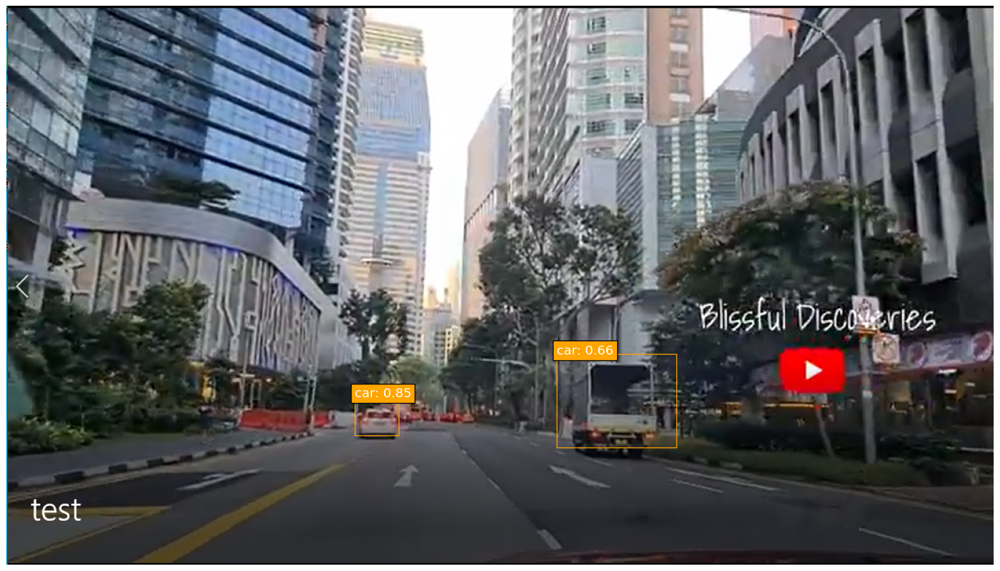
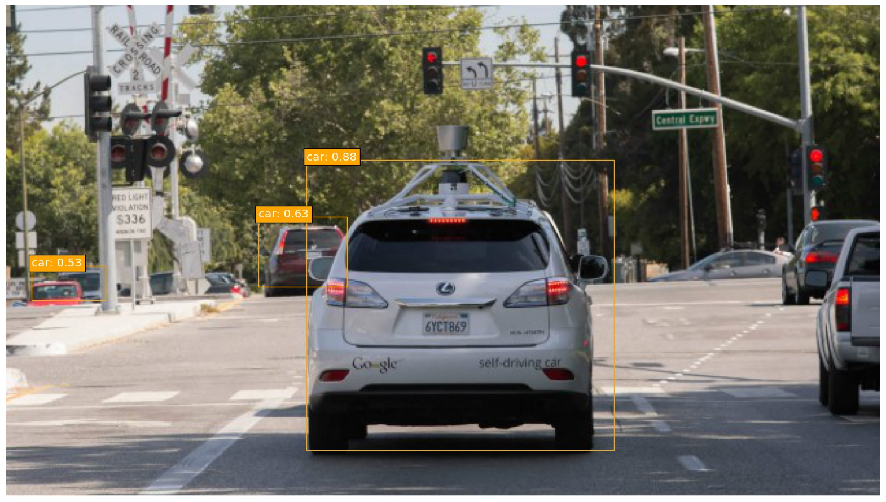
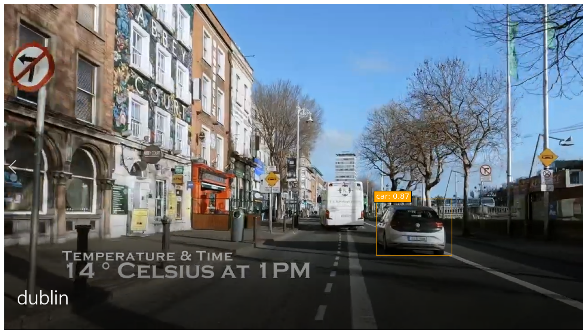
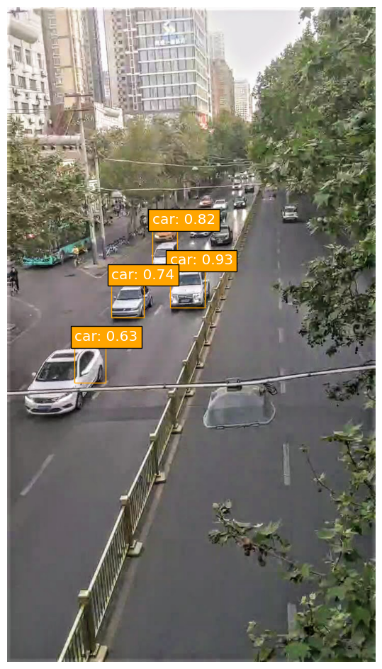
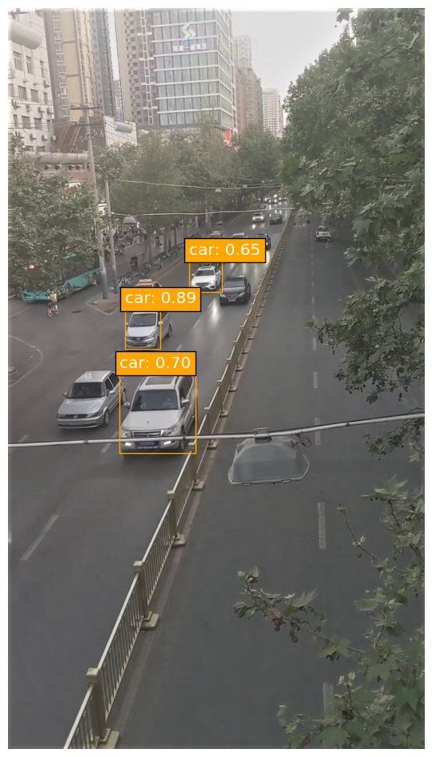

## SSD: Single-Shot MultiBox Detector implementation in Keras
---
### Contents
### Source: https://github.com/pierluigiferrari/ssd_keras

### Overview

This is a Keras port of the SSD model architecture introduced by Wei Liu et al. in the paper [SSD: Single Shot MultiBox Detector](https://arxiv.org/abs/1512.02325).

### Detections

Below are some prediction examples of the fully trained original SSD300 model.

| | |
|---|---|
| |  |
|  |  |
|  |  |
|  |  |
|  |  |
### Dependencies

* Python 3.x
* Numpy
* TensorFlow 1.x
* Keras 2.x
* OpenCV
* Beautiful Soup 4.x
