## SSD: Single-Shot MultiBox Detector implementation in Keras
---
### Contents
### Source: https://github.com/pierluigiferrari/ssd_keras

### Overview

This is a Keras port of the SSD model architecture introduced by Wei Liu et al. in the paper [SSD: Single Shot MultiBox Detector](https://arxiv.org/abs/1512.02325).

### Detections

Below are some prediction of the trained original SSD300 model.
This model was trained on the [Udacity Self Driving cars dataset](https://www.kaggle.com/datasets/sshikamaru/udacity-self-driving-car-dataset).
The detection results are seen below.

| | |
|---|---|
| |  |
|  |  |
|  |  |
|  |  |
|  |  |

# Multimodal Object Detecton
The SSD model architecture has been modified for multimodal object detection using RGB images and range-azimuth frequency maps. 
The multimodal SSD object detector is trained on the [CRUW dataset](https://www.cruwdataset.org/introduction) and consists of 3 classes (cars, cyclist & pedestrian). 

## Input Data Examples
An example of the RGB image and range-azimuth map pairs used for training.

|||
|---|---|
|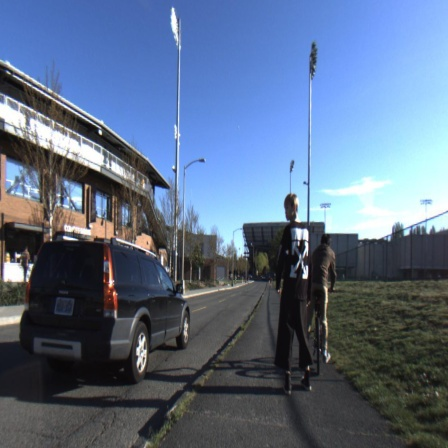||

## Detection Results-Single modal (RGB images only) vs Multimodal input
| | |  
|---|---|
| 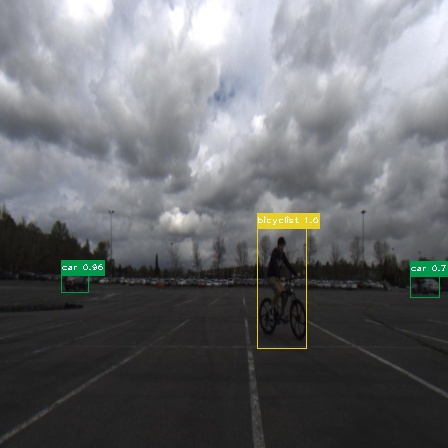| 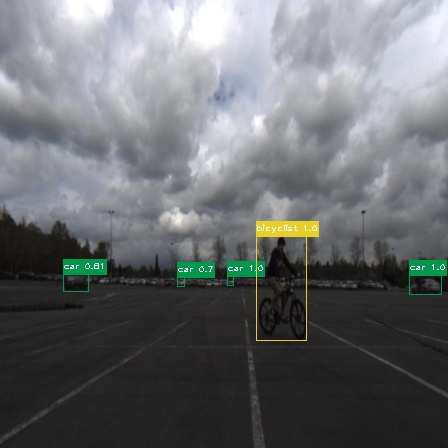 |
| 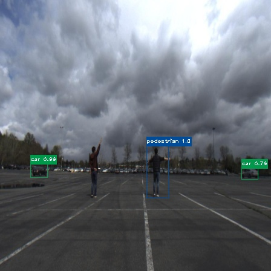|  |
| | 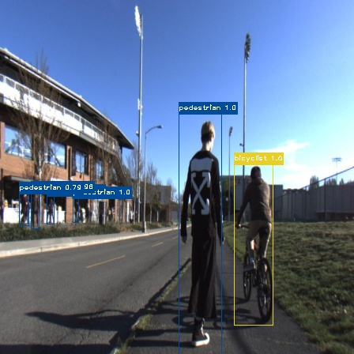 |
| | 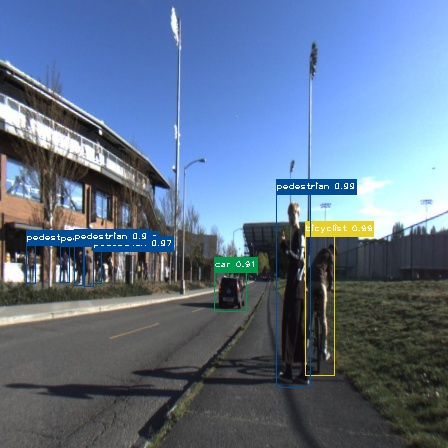 |
| 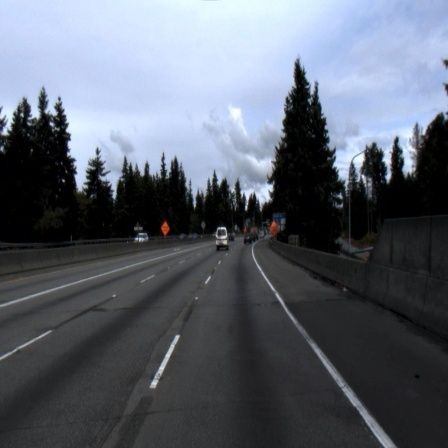| 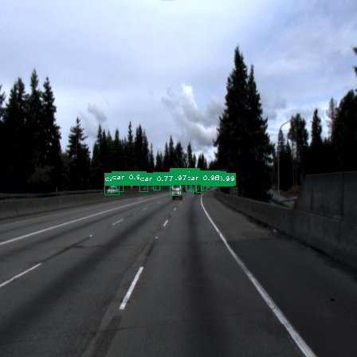 |
| | 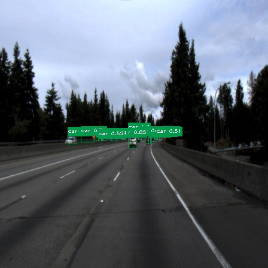 |
| 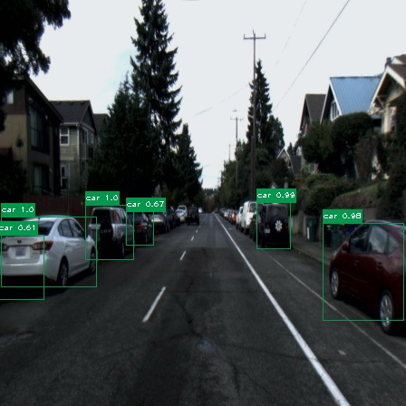| 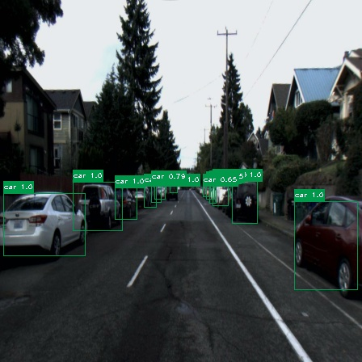 |
| 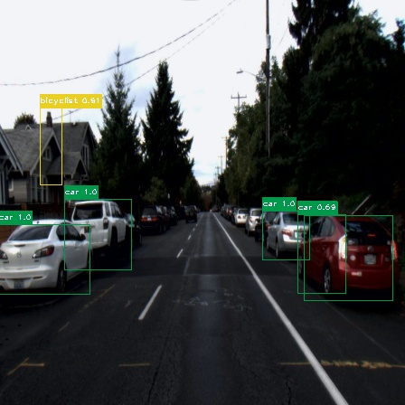|  |

## mAP
|**Model**|mAP
|-----|----------------------|
|Single modal model|44.83%
|Multi-modal model|**80.71%**|

|||
|-----|-----|
|||

### Dependencies

* Python 3.x
* Numpy
* TensorFlow 1.x
* Keras 2.x
* OpenCV
* Beautiful Soup 4.x
