# Multimodal Object Detecton
This is a Keras port of the SSD model architecture introduced by Wei Liu et al. in the paper [SSD: Single Shot MultiBox Detector](https://arxiv.org/abs/1512.02325) 
which has been modified for multimodal object detection.

# Inputs
- RGB images
- RF images

## Input Data Examples
RGB and RF map pair used in training

|||
|---|---|
|||

## Detection Results (Single modal vs Multi modal)
| | |  
|---|---|
| 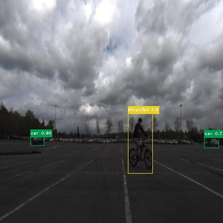| 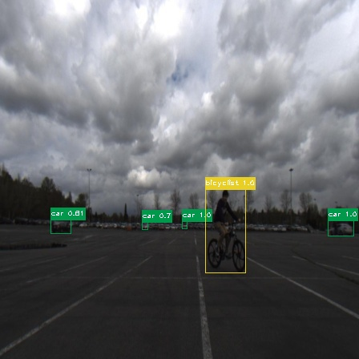 |
| 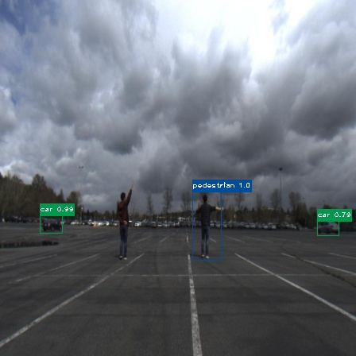| 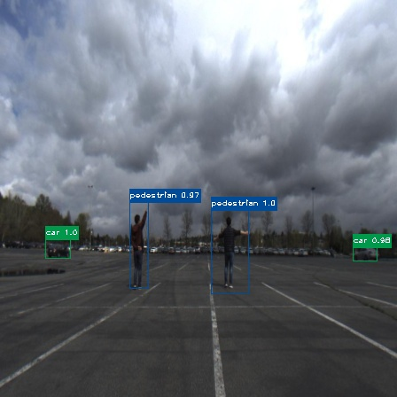 |
| 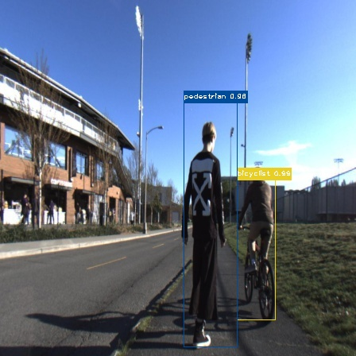| 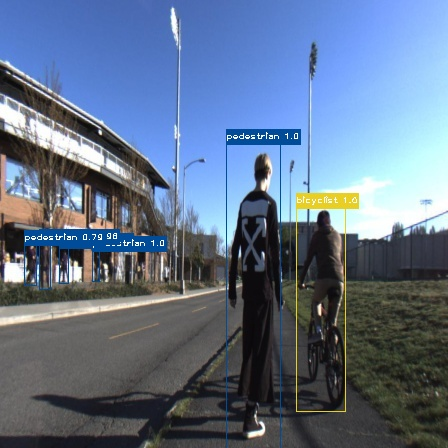 |
| 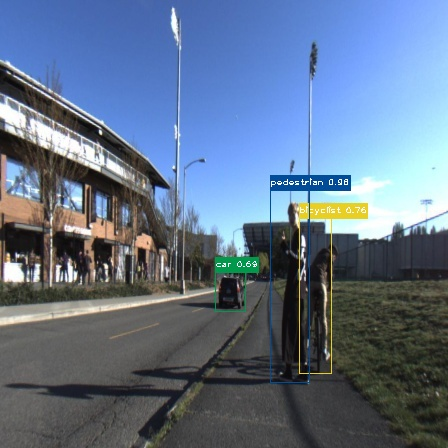| 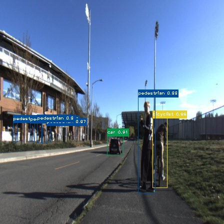 |
| 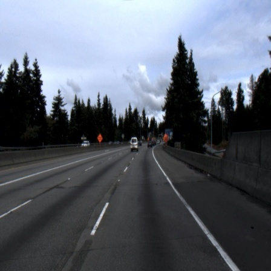| 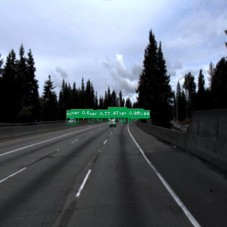 |
| 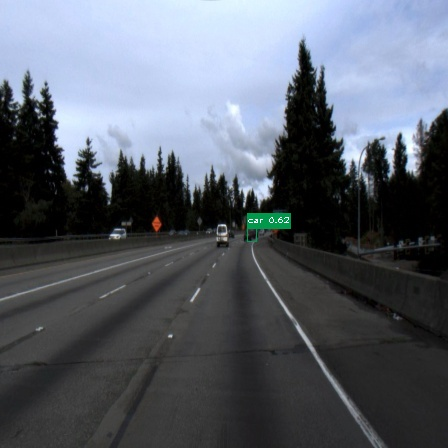|  |
| 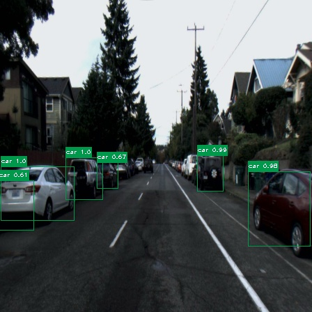| 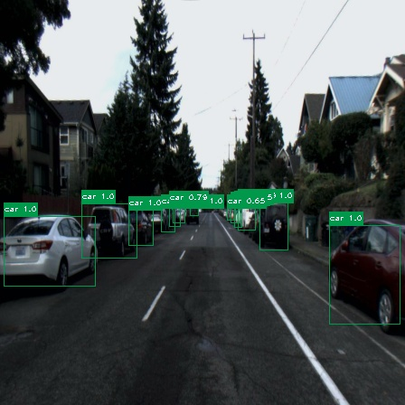 |
| 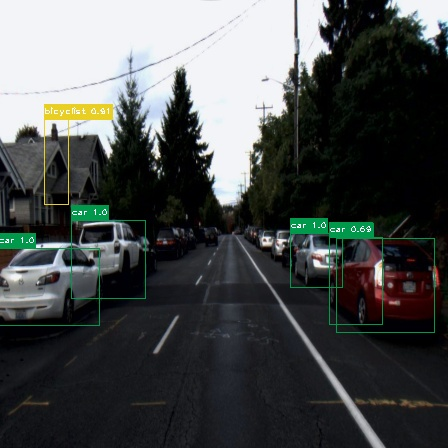| 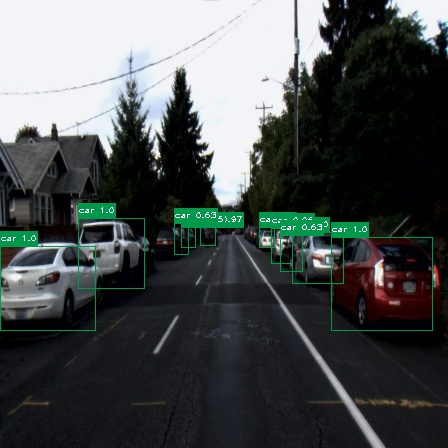 |

## mAP
|**Model**|**VOC PASCAL mAP@0.5**|**COCO mAP@0.5**|
|-----|----------------------|----------------|
|Single modal model|0.087|0.045|
|Multi-modal model|0.169|0.120|

